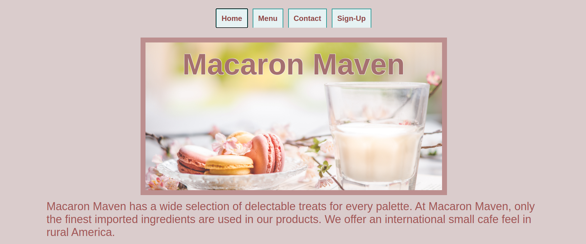
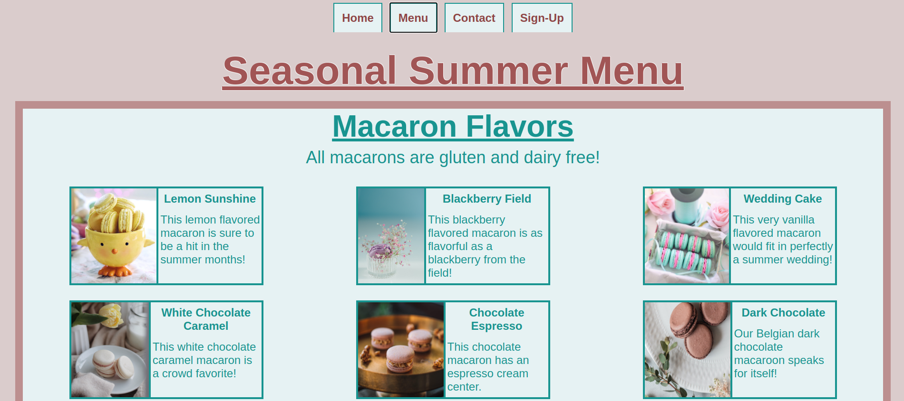

# Restaurant-Page

**Objective**

I created a three page restaurant website using JavaScript, HTML, JSON, Webpack, and CSS. The webpage is for a fictional restaurant and has a Home, Menu, and Contact page.

***Completed Website Images***

Home:

Menu:

Contact:

Sign-Up:

***Features***
1. Home Page:
   
   a. The Home page features the bakery name with background image, two paragraphs of text about the resturant, the hours and location of the bakery.
   
3. Menu Page:
   
   a. I used a function to create the menu cards instead of creating the cards one by one.
   
5. Contact Page:
   
   a. The Contact Page features two fictional bakers and contact information for the store.
   
7. The tabs at the top work of a function that clears each page and then shows the new content.

***Credits***

1. The "Home" page image was found on pexels.com. Creator Ylanite Koppens.

2. The macaron menu images were found on pexels.com.
   
    Creator List:
   
    a. Lemon and Wedding Cake: Jill Wellington

    b. Blueberry: Larissa Farbor
   
    c. White Chocolate Caramel: Ioana Motoc
   
    d. Milk Chocolate Espresso and Strawberry Rain: Valeria Boltneva
   
    e. Dark Chocolate: Diana Light
   
    f. Elderberry Vine: Cottonbro Studio
   
    g. Ripe Raspberry: Anna Pyshniuk

4. Baker images found on Unsplash.com
   
    Creator List:
   
    a. Baker One: Sincerely Media
   
    b. Baker Two: Bank Phrom

5. Sign-Up page image found on Unsplash.com

   Creator: Diliara Garifullina
